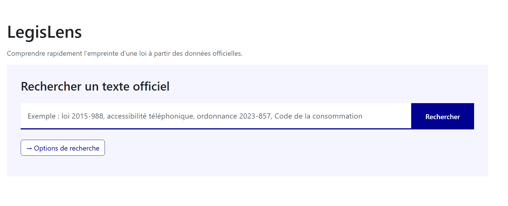
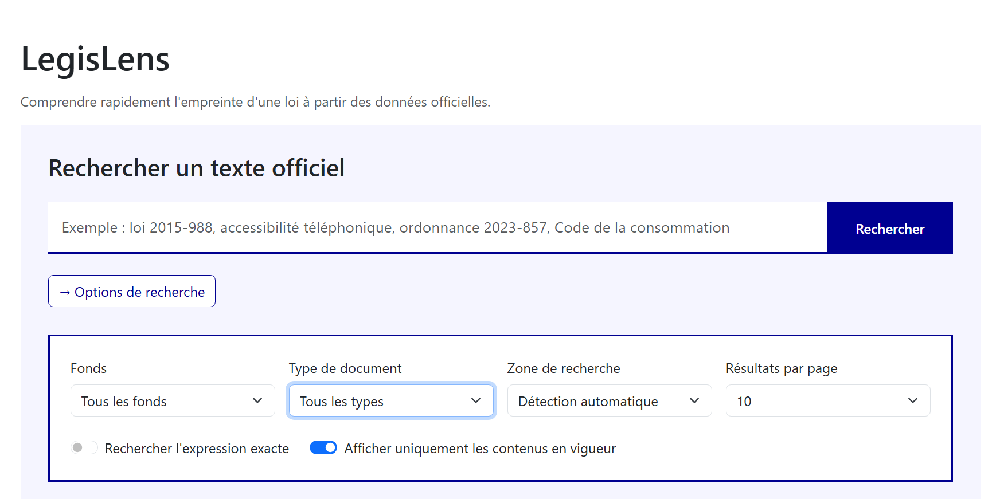
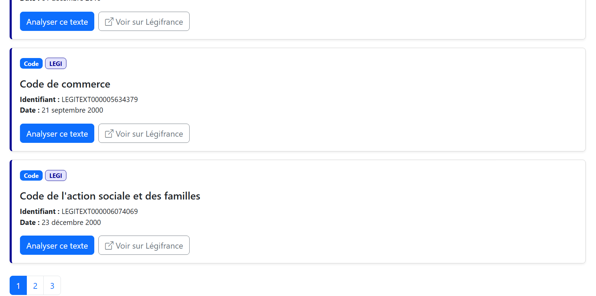
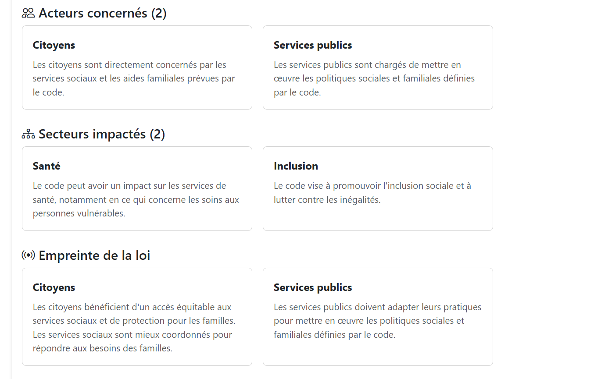

### Nom du défi

LegisLens — Comprendre l'empreinte d'une loi

### Description courte

LegisLens est un outil qui aide les citoyens, les associations et les organisations à comprendre rapidement qui est concerné par une loi, quels secteurs sont impactés, quels changements sont introduits et quelles sont les sources officielles associées.

### Porteur

Gulnur Moldobaeva

### Description longue

Les textes législatifs, réglementaires et les dossiers parlementaires sont accessibles publiquement, mais leur compréhension reste souvent complexe.

Identifier rapidement qui est concerné par une loi, quels secteurs sont impactés, quels changements sont introduits et quelles obligations en découlent nécessite aujourd'hui de consulter de nombreuses sources officielles.

LegisLens vise à rendre ces informations plus accessibles grâce aux données publiques de Légifrance et, à terme, de l'Assemblée nationale.

L'application permet notamment de :

- rechercher des textes officiels (codes, lois, décrets, ordonnances...) ;
- produire une analyse citoyenne simplifiée ;
- identifier les acteurs concernés ;
- mettre en évidence les secteurs impactés ;
- présenter les principaux changements introduits ;
- visualiser le parcours d'un texte officiel ;
- accéder directement aux sources officielles ;
- exporter l'analyse au format PDF.

Pendant le hackathon, nous avons développé une nouvelle fonctionnalité : **le Portail Association**.

Une association peut simplement renseigner l'adresse de son site Internet.

LegisLens analyse automatiquement son activité, identifie les domaines dans lesquels elle intervient ainsi que les publics concernés, puis prépare une veille législative personnalisée en proposant les recherches juridiques les plus pertinentes.

Cette fonctionnalité constitue une première étape vers un suivi automatisé des évolutions législatives susceptibles d'avoir un impact sur les associations.

À terme, LegisLens pourra également exploiter les données ouvertes de l'Assemblée nationale afin d'intégrer les dossiers législatifs, les amendements, les débats parlementaires et les votes pour offrir une vision complète du cycle de vie d'une loi.

Toutes les informations présentées reposent exclusivement sur des données publiques et des sources officielles afin de proposer une information fiable, transparente et facilement compréhensible.

### Image principale

### Contributeurs

- Gulnur Moldobaeva
- Agathe Delas

### Ressources utilisées

Cochez les ressources utilisées en remplaçant **[ ]** par **[x]**.

- [x] premier-ministre-legi — Codes, lois et règlements consolidés ✺ Premier ministre
- [x] premier-ministre-jorf — Édition « Lois et décrets » du Journal officiel ✺ Premier ministre
- [x] premier-ministre-dole — Dossiers législatifs Légifrance ✺ Premier ministre

### Ressources envisagées pendant le hackathon

- [ ] an-dossiers-legislatifs — Dossiers législatifs de l'Assemblée nationale
- [ ] an-amendements-xvii — Amendements déposés à l'Assemblée nationale
- [ ] an-comptes-rendus — Comptes rendus de séance publique
- [ ] an-votes-xvii — Votes des députés

### Technologies

- Python
- FastAPI
- HTML
- CSS
- JavaScript
- API PISTE Légifrance
- Hugging Face Sentence Transformers
- Groq
- ReportLab (export PDF)

### Galerie

#### Accueil

#### Recherche avancée

#### Résultats de recherche

#### Analyse citoyenne

#### Portail Association

### Documents

- README.md
- DEFI.md
- 🎥 [Vidéo de démonstration de LegisLens](https://raw.githubusercontent.com/GG-DWA/LegisLens/main/hackathon-an-2026/docs/LegisLens_demo.mp4)
